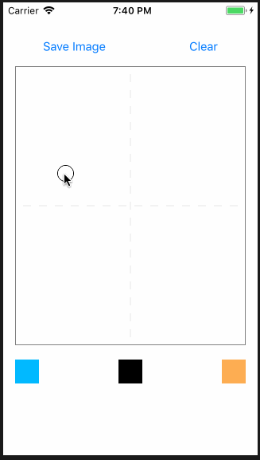

# Drawing Board

## Demo

## Introduction

简单画板。

1. `UIView` 中重写 `touchesBegan` `touchesMoved`。
2. `[Line]()` 保存线条。
3. 选择颜色、保存图片。

## Todo
1. 线条更加自然，有粗细变化。 eg: [AfryMask/AFBrushBoard - 毛笔画板](https://github.com/AfryMask/AFBrushBoard)

### Reference

- [cjiong/LearnSwift - DrawingBoard](https://github.com/cjiong/LearnSwift/tree/master/Project%2046%20-%20DrawingBoard)
