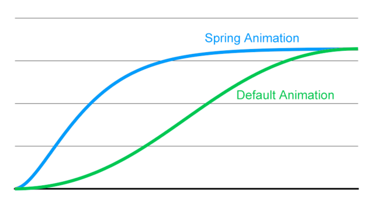

# Login Animation

## Demo

## Introduction

登录框的动效。

1. `.storyboard` 的自动布局。
2. `UIView.animate(withDuration, delay, usingSpringWithDamping, initialSpringVelocity, options, animations, completion)` 方法的使用。

- `usingSpringWithDamping` 值越小动画越夸张

- `initialSpringVelocity` 值越大则起始速度越大

- `options` 的各个动画曲线

- `Default` 与 `Spring` 的区别

### Reference

- [抓住iOS的未来 - 30天学习编写30个Swift小程序 - 16](http://www.jianshu.com/p/c6ae28964ad5)
