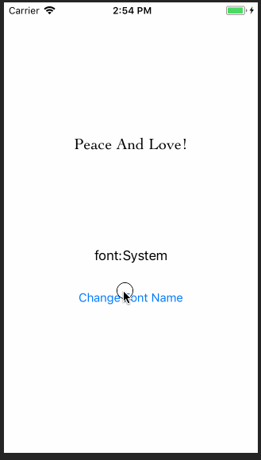

# Change Font Name

## Demo



## Introduction
修改 Label 字体。

字体遍历：
``` Swift
let familyNames = UIFont.familyNames
for familyName in familyNames {
  print("++++++ \(familyName)")
  let fontNames = UIFont.fontNames(forFamilyName: familyName)
  for fontName in fontNames {
    print("----- \(fontName)")
  }
}
```

## Reference

- [抓住iOS的未来 - 30天学习编写30个Swift小程序 - 1](http://www.jianshu.com/p/c6ae28964ad5)
