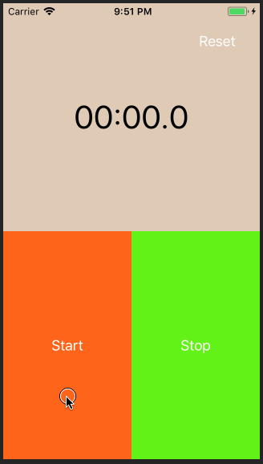

# Timer

## Demo

## Introduction
计时器。

1. SnapKit 布局。
2. `Timer`。
3. guard 语句。

## Reference
- [抓住iOS的未来 - 30天学习编写30个Swift小程序 - 2](http://www.jianshu.com/p/c6ae28964ad5)
- [Build a count down timer with Swift 3.0 – Medium](https://medium.com/ios-os-x-development/build-an-stopwatch-with-swift-3-0-c7040818a10f)
- [Swift的Guard语句](http://www.jianshu.com/p/3a8e45af7fdd)
