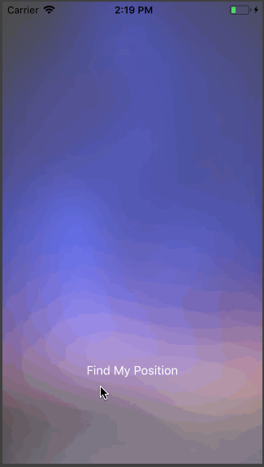

# Find My Position

## Demo

## Introduction
CoreLocation 简单定位。

1. plist 权限配置 `NSLocationAlwaysAndWhenInUseUsageDescription` `NSLocationWhenInUseUsageDescription`。
2. `CLLocationManager` 进行定位。
3. 经纬度坐标转化真实地理位置。
4. 毛玻璃效果。

## Reference
- [抓住iOS的未来 - 30天学习编写30个Swift小程序 - 3](http://www.jianshu.com/p/c6ae28964ad5)
- [Swift - 经纬度位置坐标与真实地理位置相互转化](http://www.hangge.com/blog/cache/detail_785.html)
- [Swift - 实现毛玻璃效果（Blur、模糊、虚化背景元素）](http://www.hangge.com/blog/cache/detail_1135.html)
