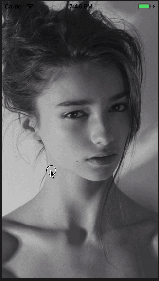
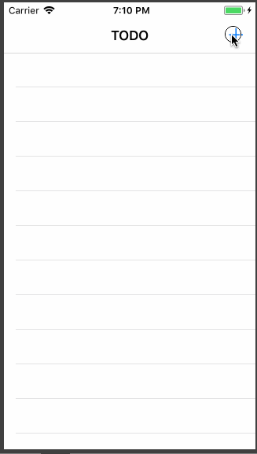
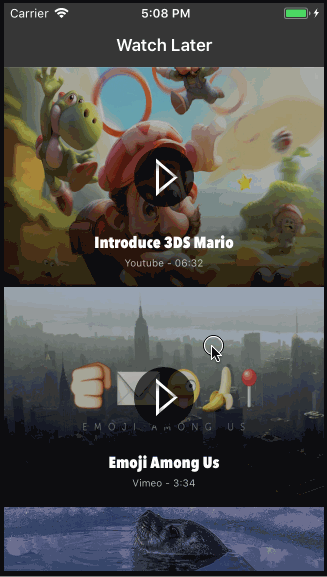
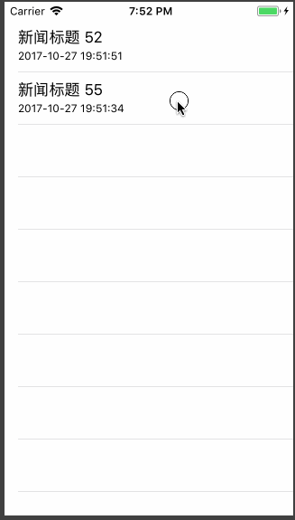
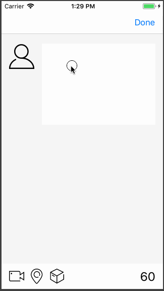
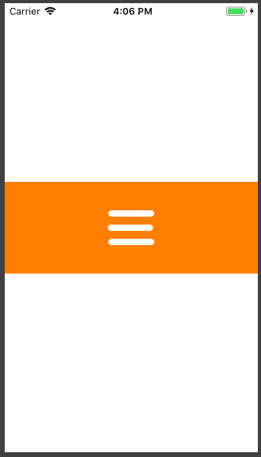
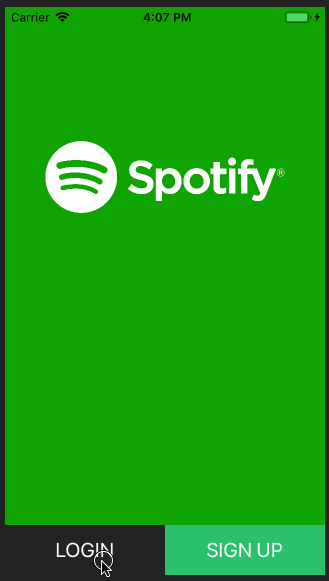
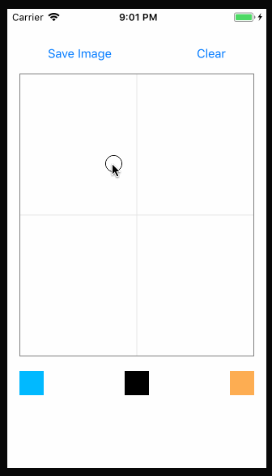
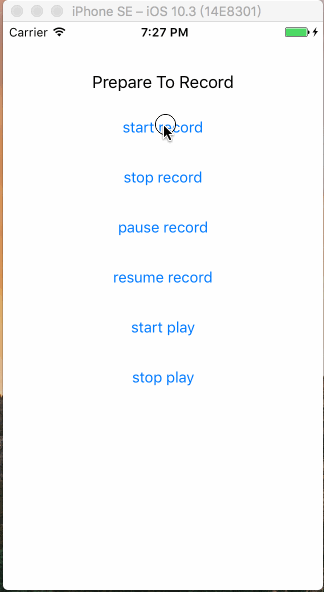

# 99 Projects of Swift

模仿 [allenwong/30DaysofSwift](https://github.com/allenwong/30DaysofSwift) 的 Swift 学习项目。项目目录倒序排列。

## [014 Video Splash](./014-video-splash)
背景视频。

## [013 Simple Photo Browser](./013-simple-photo-browser)
图片缩放。

## [012 CoreData TODO List](./012-coredata-todo-list)
使用 CoreData 的 TODO 列表。

## [011 Video Player](./011-video-player)
视频播放。

## [010 Pull To Refresh](./010-pull-to-refresh)
下拉刷新。

## [009 Limited Input Text Field](./009-limited-input-text-field)
输入框字数限制。

## [008 Find My Position](./008-find-my-position)
CoreLocation 简单定位。

## [007 Meun Button Animation](./007-meun-button-animation)
菜单键动画。

## [006 Timer](./006-timer)
定时器。

## [005 Change Font Name](./005-change-font-name)
修改 Label 字体。

## [004 Login Animation](./004-login-animation)
登陆框动效。

## [003 Drawing Board](./003-drawing-board)
简单画板。

## [002 Audio Record & Play](./002-audio-record-play)
`AVAudioRecorder` `AVAudioPlayer` 小例。

## [001 Scroll Card](./001-scroll-card)
`UICollectionView` `UICollectionViewFlowLayout` 卡片横向缩放滑动。

