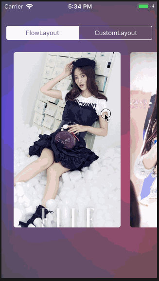

# 99 Projects of Swift

模仿 [allenwong/30DaysofSwift](https://github.com/allenwong/30DaysofSwift) 的 Swift 学习项目。项目目录倒序排列。

## [005 Change Font Name](./005-change-font-name)
修改 Label 字体。

## [004 Login Animation](./004-login-animation)
登陆框动效。

## [003 Drawing Board](./003-drawing-board)
简单画板。

## [002 Audio Record & Play](./002-audio-record-play)
`AVAudioRecorder` `AVAudioPlayer` 小例。

## [001 Scroll Card](./001-scroll-card)
`UICollectionView` `UICollectionViewFlowLayout` 卡片横向缩放滑动。

